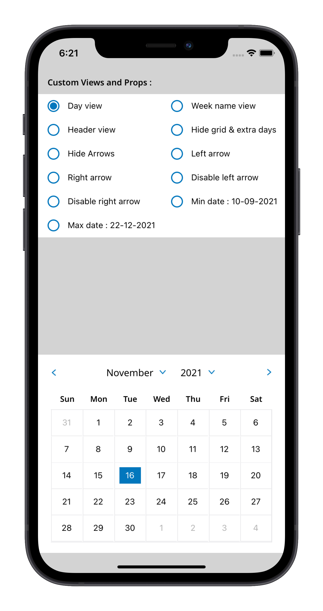
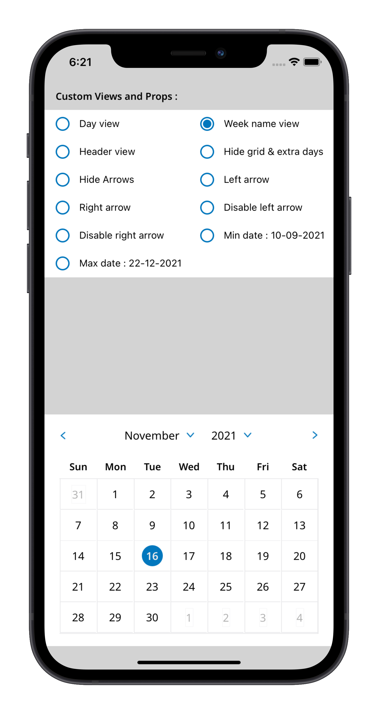
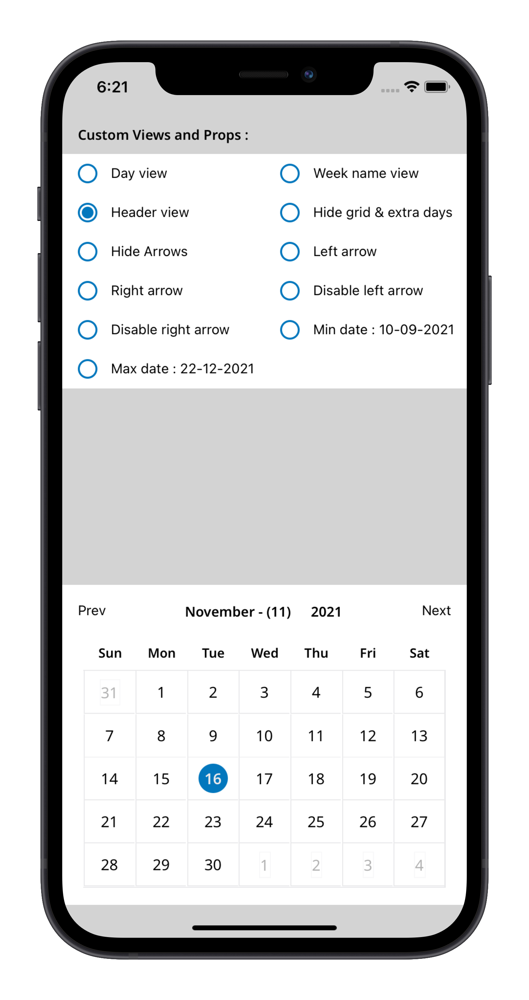
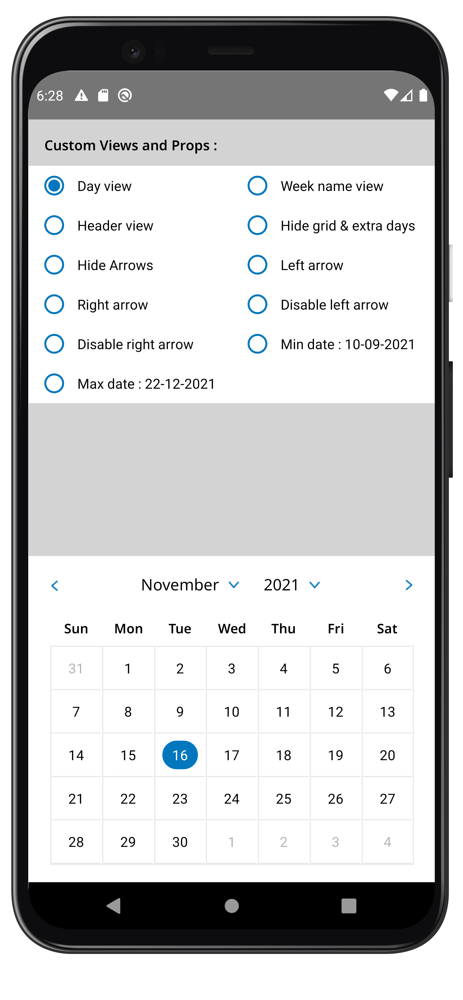
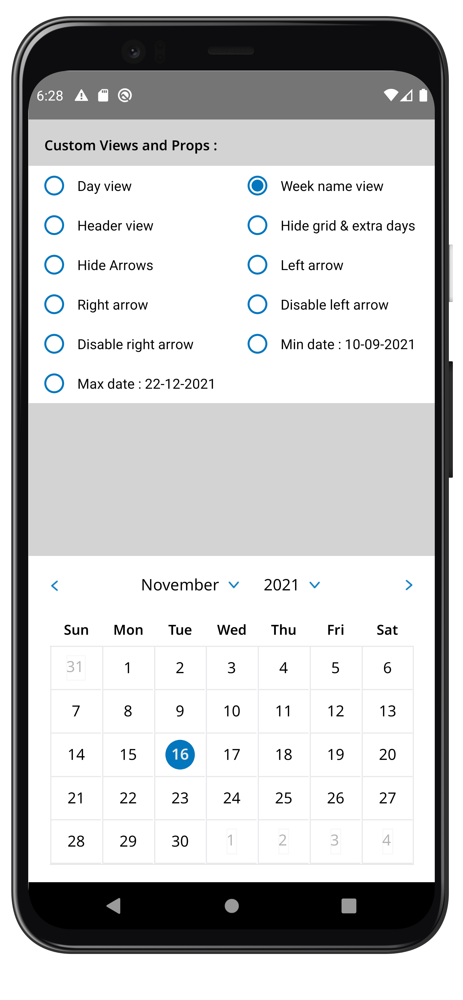
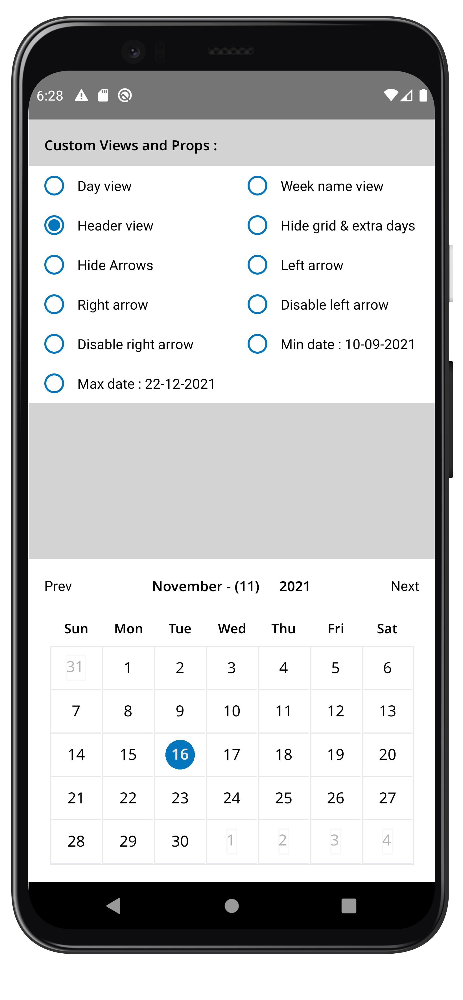

# react-native-picker-calendar-view

[](https://www.npmjs.com/package/react-native-picker-calendar-view) 
 

This is a highly customizable package can be used as a simple date picker as well as a calendar view for React Native.<br>
It is compatible with both Android and iOS platforms.

## Spread Your ❤️:
[](https://github.com/yuvraj24)  [](https://twitter.com/yuvrajpy)
<br>

## Installation

If using yarn:

```
yarn add react-native-picker-calendar-view
```

If using npm:

```
npm i react-native-picker-calendar-view
```

## Screenshots : IOS

|         Custom day view         |           Custom week view        |      Custom header view             |
|---------------------------------|-----------------------------------|-------------------------------------|
|  |   |   |
<br>

## Screenshots : ANDROID

|         Custom day view         |           Custom week view        |      Custom header view             |
|---------------------------------|-----------------------------------|-------------------------------------|
|  |   |   |
<br>


## Usage
For example code, <a href="https://github.com/yuvraj24/react-native-picker-calendar-view/tree/master/example" target="_blank">Click here</a>

### Basic Props
```
{

	/** Unique testid for the component */
	testId?: string;

	/** Parent style for the entire component. */
	style?: StyleProp<ImageStyle>;

	/** Display grid like view around each day, DEFAULT = true */
	isShowGrid?: boolean;

	/** Hide previous month & next month's extra days, DEFAULT = false */
	hideExtraDays?: boolean;

	/** Hide month & year navigation arrows, DEFAULT = false */
	hideArrows?: boolean;

	/** Callback which get invloked when a date is clicked, The function receives day, month & year as parameter  */
	onDayPress?: (props: { day: number; month: number; year: number }) => void;

	/** Replace default month and year title with custom one. The function receive a month ,year & other header props as parameter */
	renderHeader?: (props: {
		month: number;
		monthName: string;
		year: number;
		toggleMList: () => void;
		toggleYList: () => void;
		prevMonth: () => void;
		nextMonth: () => void;
	}) => JSX.Element;

	/** Render custom day component. the function receive all day props */
	renderDay?: (props: {
		testId?: string;
		index: number;
		day: DayProps;
		month: number;
		year: number;
		onDayPress?: (props: {
			day: number;
			month: number;
			year: number;
		}) => void
	}) => JSX.Element;

	/** Render custom week component. the function receive a all week props */
	renderWeekName?: (props: {
		testId?: string;
		value: {
			d: string; // eg. { d: "1", dd: "01", ddh: "Su", ddd: "Sun", dddd: "Sunday" },
			dd: string;
			ddd: string;
			dddd: string;
			ddh: string;
		};
	}) => JSX.Element;

	/** Replace left arrows with custom ones */
	renderLeftArrow?: () => JSX.Element;

	/** Replace right arrows with custom ones */
	renderRightArrow?: () => JSX.Element;

	/** Handler which gets executed when press arrow icon left. It receive a callback can go back month */
	onPressArrowLeft?: (props: {
		prevMonth?: () => void;
		month?: number;
		nextMonth?: () => void;
	}) => void;

	/** Handler which gets executed when press arrow icon right. It receive a callback can go next month */
	onPressArrowRight?: (props: {
		prevMonth?: () => void;
		month?: number;
		nextMonth?: () => void;
	}) => void;

	/** Disable left arrow */
	disableArrowLeft?: boolean;

	/** Disable right arrow */
	disableArrowRight?: boolean;

	/** Minimum date that can be selected, dates before minDate will be grayed out. Format = "DD-MM-YYYY" */
	minDate?: string;

	/** Maximum date that can be selected, dates after maxDate will be grayed out. Format = "DD-MM-YYYY" */
	maxDate?: string;
}

```

## Documentation :

### CalendarDateView

| **PropName**           | **PropType**     | **Parameters**                         | **Purpose**                                    |  **Default**   |
| :--------------------- | :--------------- | :---------------------------------- | :----------------------------------------------   | :------------- |
| testId                 |    `string`      |                                     |  Unique testid for the component                  |                |
| style.                 |  `ImageStyle`    |                                     |  Parent style for the entire component.           |                |
| isShowGrid             |    `boolean`     |                                     |  Display grid like view around each day           |     true       |
| hideExtraDays          |    `boolean`     |                                     |  Hide previous month & next month's extra days    |     false      |
| hideArrows             |    `boolean`     |                                     |  Hide month & year navigation arrows.             |     false      | 
| disableArrowLeft       |    `boolean`     |                                     |  Disable left arrow.                              |     false      | 
| disableArrowRight      |    `boolean`     |                                     |  Disable right arrow.                             |     false      | 
| minDate                |    `string`      |                                     |  Minimum date that can be selected, dates before minDate will be grayed out.                                                                                                                                         |   DD-MM-YYYY       | 
| maxDate                |    `string`      |                                     |  Maximum date that can be selected, dates after maxDate will be grayed out.                                                                                                                                           |   DD-MM-YYYY       |  
| onDayPress             |    `function`    |  { day: number, month: number, year: number }    |   Callback which gets invloked when a date is clicked, The function receives day, month & year as parameter                                                                                               |                | 
| renderHeader           |  `JSX.Element`   |  { month: number, monthName: string, year: number, toggleMList: () => void toggleYList: () => void, prevMonth: () => void, nextMonth: () => void }                                                    |  Replace default month and year title with custom one. The function receive a month ,year & other header props as parameter                                                                                         |                | 
| renderDay              |  `JSX.Element`   |  { testId: string, index: number, day: DayProps, month: number, year: number, onDayPress:  { day: number, month: number, year: number }                                                           |  Render custom day component. the function receive all day props               |                | 
| renderWeekName         |  `JSX.Element`   |  { testId: string, value: { d: string, dd: string, ddd: string, dddd: string, ddh: string }}                                                                                                         |  Render custom week component. the function receive a all week props                                                                                                                                                   |                | 
| renderLeftArrow        |  `JSX.Element`   |                                     |  Replace left arrows with custom ones             |                | 
| renderRightArrow       |  `JSX.Element`   |                                     |  Replace right arrows with custom ones            |                | 
| onPressArrowLeft       |  `function`      |  { prevMonth: () => void, month: number, nextMonth: () => void }  | Handler which gets executed when press arrow icon left. It receive a callback can go back month                                                                                    |                | 
| onPressArrowRight       |  `function`      |  { prevMonth: () => void month: number nextMonth: () => void } | Handler which gets executed when press arrow icon right. It receive a callback can go next month                                                                                   |                | 


## Contributing

See the [contributing guide](CONTRIBUTING.md) to learn how to contribute to the repository and the development workflow.

## License

MIT

## About Me

### Yuvraj Pandey
*I am a passionate Engineer which likes to push himself on various fronts of technologies.*  

For more exciting updates follow me,

<a href="https://twitter.com/yuvrajpy" target="_blank"></a> &nbsp;&nbsp;&nbsp;&nbsp;&nbsp;&nbsp;&nbsp;&nbsp;&nbsp;<a href="https://www.linkedin.com/in/yuvrajpy" target="_blank"></a>&nbsp;&nbsp;&nbsp;&nbsp;&nbsp;&nbsp;&nbsp;&nbsp;&nbsp;<a href="https://github.com/yuvraj24" target="_blank"></a>&nbsp;&nbsp;&nbsp;&nbsp;&nbsp;&nbsp;&nbsp;&nbsp;&nbsp;<a href="https://yuvrajpy.medium.com/" target="_blank"></a>&nbsp;&nbsp;&nbsp;&nbsp;&nbsp;&nbsp;&nbsp;&nbsp;&nbsp;<a href="https://play.google.com/store/apps/developer?id=Yuvraj+Pandey"></a>

